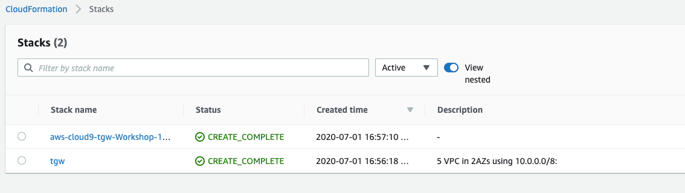

# VPCs - Deployment

We need to get our infrastructure in place. The following CloudFormation template will build out _five_ VPCs. Pick the region you want to and keep that choice during any lab.

As noted earlier in the lab, this is what the VPCs look like:

- Three VPCs for our Development, Test, and Production environments (one VPC each).
- One VPC for our Shared Services, such as VPC Endpoints, Hybrid DNS and NAT Gateway.
- One VPC emulating our Datacenter.

Click on the CloudFormation Launch link below that corresponds to the AWS Region in which you want to deploy the workshop.  
_Note: if you are sharing the AWS account with someone else be sure to pick different regions._

   
   
   
   
   
   

1. If you are sharing the account with someone else doing the workshop, add your initals to the **Stack name**. This will make any IAM roles or other global resources unique.

2. Scroll down to the bottom of the **Review name_of_your_stack** and check the **I acknowledge that AWS CloudFormation might create IAM resources with custom names.** Click the **Create** button in the lower right.
   

3. Wait for the Stacks to show **Create_Complete**. A couple of stacks will be deployed:
   

