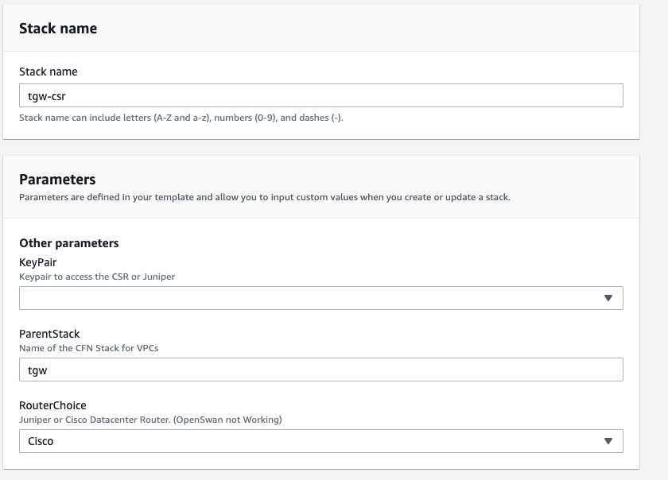
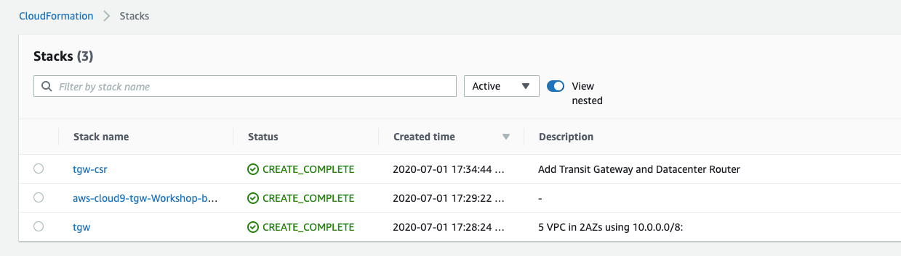

# Datacenter Router and Transit Gateway Deployment

Using a predefined CloudFormation template we will deploy a Cisco Router (Cisco CSR) into the Datacenter VPC simulating our on-premise VPN router.
In addition, a Transit Gateway will be deployed with a couple of Transit Gateway route tables.

1. Click on the CloudFormation Launch link below that corresponds to the AWS Region in which you deployed the first stack:

   
 

2. For the **ParentStack** name, make sure you use the stack name created during the previous lab (must be entered exactly to work). Select the Key Pair created before and also stick with "Cisco" as the router vendor. Click **Next**.
   

3. For **Configuration stack options** we don't need to change anything, so just click **Next** in the bottom right.

4. Scroll down to the bottom of the **Review name_of_your_stack** and check the **I acknowledge the AWS CloudFormation might create IAM resources with custom names.** Click the **Create** button in the lower right.
   

5. Wait for the Stack to show **Create_Complete**.
   