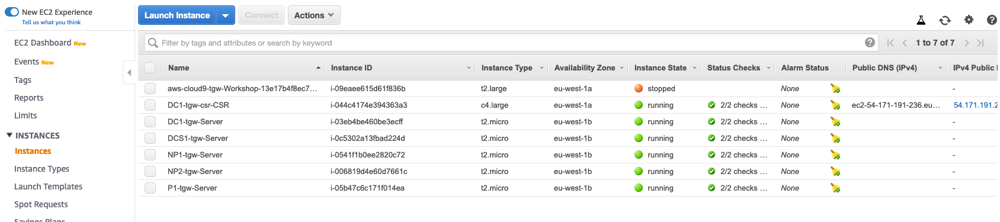
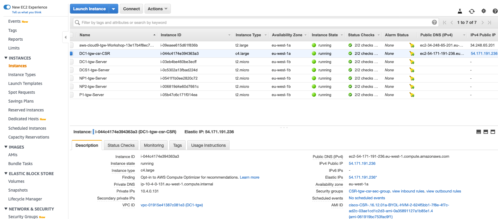

# Cisco CSR Router Access using AWS Cloud9 Environment

In order to access via SSH and work on the Datacenter router, we will use AWS Cloud9. Instead of using an external SSH client (i.e. Putty) we will leverage on Cloud9 for SSH connectivity to the Cisco router.

Cloud9 is an IDE platform that is managed as a service for us. We will be using just a fraction of its capability. But this intro should give you some ideas about how you can provide a shared environment for managing your infrastructure. Cloud9 leverages an EC2 instance for its duties. The EC2 instance will automatically download some files for us pulling a Github repository. This is the same EC2 instance that you might have spotted offline before:

In order to access Cloud9, follow this simple steps:

1. In the AWS Management Console change to the region you are working in. This is in the upper right hand drop down menu.

1. In the AWS Management Console choose **Services** then select **Cloud9**.

1. From **Your Environments** page click the **Open IDE** button on the Workshop Environment Box. **Important!** Make sure the user accessing Cloud9 is the same user that deployed the Cloudformation stack on the previous step, otherwise it won't be able to use the Cloud9 environment (permissions)

1. This will bring up the Cloud9 Console and download the Github repo to your working folder.

1. From the **file** menu select **Upload Local Files...** and click **Select files** button, navigate to the key file you created earlier. _Note: it should have a .pem extension_. In the Cloud9 console, the file will show up in the left-hand folder list.
   
   

1. In the main panel click the **x** sign next to the **welcome** tab to close this tab.

1. In the main panel click the **+** sign and launch a **New Terminal**. This is a bash shell on the Cloud9 Instance.

1. Move the key to the .ssh folder: `mv _key_name_.pem ~/.ssh/`

1. Restrict access to the key file: `chmod 400 ~/.ssh/_key_name_.pem`

1. From another browser tab, navigate again to the Management Console and choose **Services** then select **CloudFormation**.

1. From the left-hand menu, select **Exports** in the left hand menu and type **ssh** into the 'Filter exports' box. You will see the Export name: DC1-_stack-name_-CSRssh and should copy the **Export value**
   

1. Back on the **Cloud9** Browser tab paste this into the bash shell. _Note: in the command you will notice the -i reference to the pem file you just copied, this is the private half of the key pair. The public key is already placed on the Cisco CSR_. Answer **yes** to **Are you sure you want to continue connecting (yes/no)?**

1. You now are connected to the Cisco CSR in the Datacenter VPC. Let's take a brief look at a few configuration elements:

- The Cisco CSR device has been deployed within a new EC2 instance. This new EC2 instance holds a private ip and has also been configured with an Elastic ip:
   

- Lets now look at the router Interfaces by typing at the #prompt: **show ip interface brief** or **sh ip int br** for short. You will see the GigabitEhternet1. The interface ip is mapped to the physical ip of the instance.

- Take a look at the route table on the CSR by typing at the #prompt: **sh ip route**. You will see S\* 0.0.0.0/0 which is a static default route pointing to the 10.4.0.1 address. This is the local VPC router within the DataCenter VPC. 

- As mentioned before, the EC2 instance holds an Elastic IP address, which will be used as the tunnel destination ip once we setup the VPN between the datacenter and the Transit Gateway. The public Elastic IP is a one-to-one mapping to the private 10.4.x.x IP address you just SSHed to.
