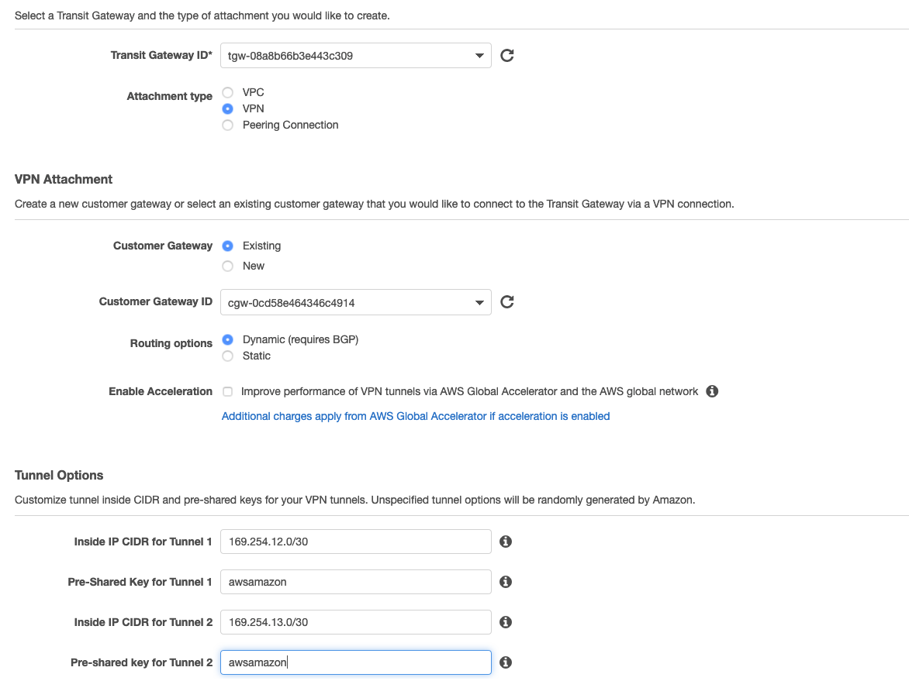
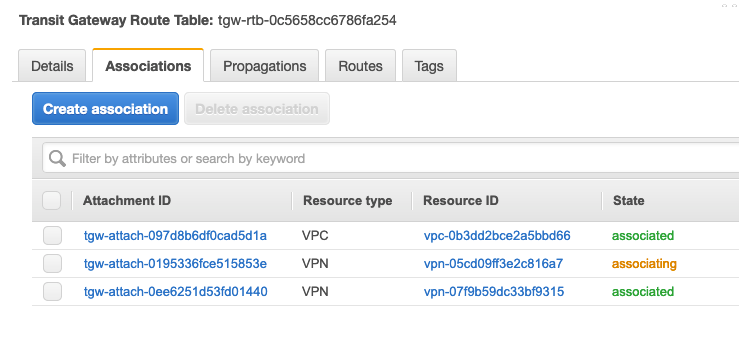
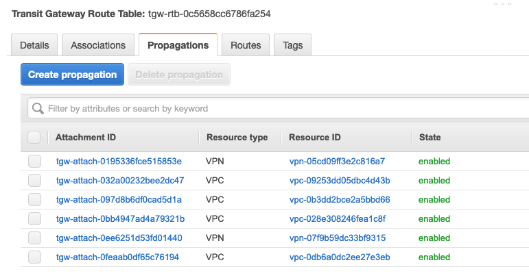
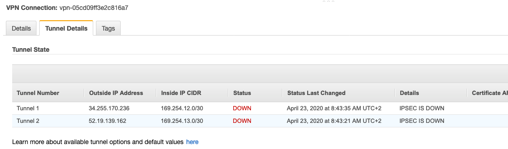

# Additional ECMP Paths

Bandwidth scaling and High Availability are built into the Transit Gateway inherently as well as via multiple Availability Zone (AZ) attachments to our VPCs. However; for connectivity back to our Datacenter, we have some things to consider. In the real world, we would create another Customer Gateway on a totally separated physical device. Ideally, this is physically as fault-isolated from the first Customer Gateway as we can make it (think, across the room or even in another communications room with separate connectivity and power if we have it). But in order to distribute load across both Customer Gateways within the datacenter you would typically use another tier of routers (shown below as a core router) to balance the traffic. For our demo purposes, lets build it on the same Cisco CSR we have in our simulated Datacenter so we can see more ECMP in action.


## Adding 2 ECMP paths

1. In the AWS Management Console switch to the region you are working in. This is in the upper right hand drop down menu.

1. In the AWS Management Console choose **Services** then select **VPC**.

1. From the menu on the left, Scroll down and select **Transit Gateway Attachments**.

1. You will see the VPC Attachments listed, but we want to add an additional VPN attachment. Click the **Create Transit Gateway Attachment** button above the list.

1. Fill out the **Create Transit Gateway Attachment** form.

  - **Transit Gateway ID** will have a name Tag matching your first CloudFormation Stack name.
  - **Attachment Type** is **VPN**
  - **Customer Gateway** (CGW) will be **Existing**. _Note: the CloudFormation template created the CGW. It is the same IP address used in the previous VPN._
  - Leave **Routing options** set to **Dynamic(requires BGP)**. _Note: BGP is required if you want traffic to balance across more than one VPN tunnel at a time (ECMP or Equal Cost Multipathing)_
  - For **Inside IP CIDR for Tunnel 1** use **169.254.12.0/30** for CIDR. _Note: there are different ip addresses from the previous VPN_
  - Do not tick Enable Acceleration as we won't be using it for this lab. However, for production environments GA delivers an enhanced VPN experience thanks to the use of anycast endpoints being advertised from our global network of points of presence (POPs) 
  - For **Pre-Shared Key for Tunnel 1** use **awsamazon**
  - For **Inside IP CIDR for Tunnel 2** use **169.254.13.0/30** for CIDR. _Note: these are different ip addresses from the previous VPN_
  - For **Pre-Shared Key for Tunnel 2** use **awsamazon**
  - Once the page is filled out, click **Create attachment** at the bottom right.
    

1.  While we are on the **Transit Gateway Attachments** page, lets go back to the top and give the VPN attachment a name. Scan down the **Resource type** column for the VPN Attachment. _Note: you may have to hit the refresh icon in the upper right above the table to get the new VPN to show. If you click the pencil that appears when you mouse over the **Name** column, you can enter a name. Be sure to tick the check mark to save the name._

1.  From the Menu on the Left Select **Site-to-Site VPN Connections**. From the main panel, you likely will see the VPN is in State **Pending**. That's fine. Let's take a look towards the bottom, and click the **Tunnel Details** tab. Note down the two **Outside IP Address**es. We want to record them in the order of the one pairing up with the **Inside IP CIDR** range 169.254.**12**.0/30 first (similar as we did before with the other VPN connection). _Note: You can use Cloud9 as a scratch pad, by clicking the + in the main panel and selecting **New file**. be sure to paste them in the right order!_

1.  From the Menu on the left select **Transit Gateway Route Tables**. From the table in the main panel select **Green Route Table**. Let’s take a look towards the bottom, and click the **Associations** tab. Associations mean that traffic coming from the outside towards the Transit gateway will use this route table. A routing lookup will take place in the TGW at this stage and the packet will be forwarded based on the information available within the “Routes” tab. _Note: An attachment can only be Associated with one route table. But a route table can have multiple associations._ Here in the **Green Route Table** a couple of associations are already present: the Datacenter Services VPC and the VPN created on the previous section. Click **Create associations** in the Associations tab. From the drop-down list, select the remaining VPN connection. Click **Create association**. 

    

1.  While at the **Transit Gateway Route Tables**, take a look at the **Propagations** tab. These are the attachments that propagate its prefixes into the route table (take it as an import into the route table). An attachment can propagate to multiple route tables. For this lab we want the datacenter addressing (the one reachable via the VPN connections) propagated to all of the route tables so the VPCs associated with each route table can route back to the datacenter. Let’s start with the **Green Route Table**. We can see all of the VPCs are propagating their CIDR to the route table and also the other VPN connection has some presence. Click on **Create Propagation** and propagate from the remaining VPN attachment. At the end, you should have something like (note that resource ids might not match with previous screenshots):

    

1.  Repeat the above step on the Propagations tab for the **Red Route Table** and the **Blue Route Tables**.

1.  Same as before, it's now time to get the other end ready and apply the configuration to the Cisco router so we can bring the remaining VPN tunnels up

1.  Back at the Cloud9 browser tab, using the two VPN public tunnel endpoints ip addresses generated from the step above, cd to tgwwalk on the Cloud9 bash console and run the bash script appending the 2 ips and the name of the configuration file:
  ```
  ./create2ndcsr.sh. publicip1 publicip2 my2ndcsrconfig.txt
  ```
  Note: THIS is a different Script than before! Be sure to put the address that lines up with Inside IP CIDR address 169.254.12.0/30 for ip1. This will result in a Cisco configuration file ready to be used. 

  Example from my Site-to-Site VPN, note your public ips will be different:

  

  ```
  cd tgwwalk
  ##./create2ndcsr.sh ip1 ip2 outputfile
  ./create2ndcsr.sh 34.255.170.236 52.19.139.162 my2ndcsrconfig.txt
  ```

1.  On the left hand panel, the output file **my2ndcsrconfig.txt** should be listed. You may have to open the tgwwalk folder to see the txt file. Open the file with **cat** or any alternative and copy all the file content

1. Using a bash tab in cloud9, ssh back into the CSR. _Note: the **ssh** command for the CSR is available from the **Exports** menu in **CloudFormation**._

1.  Enter configuration mode by entering **conf t**, which will take you to a config prompt:

    ```
    ip-10-4-0-17#conf t
    Enter configuration commands, one per line.  End with CNTL/Z.
    ip-10-4-0-17(config)#
    ```

1.  Once in Configuration mode _Note: you should see (config)# prompt_, paste all text (ctrl-v on pc/command-v on mac) from the output file created in step 4. This will slowly paste in the configuration.

1.  Once the paste is finished, if you are still at the (config)# or (config-router) prompt, type **end** and press enter.

1.  Now lets look at the new interfaces: **sh ip int br**. You should see new interfaces: Tunnel3 and Tunnel4 and they both should show up. _Note: if they do not change from down to up after a 2 minutes, likely cause is the ip addresses were flipped in the createc2ndsr script._

    

1.  Lets make sure we are seeing the routes on the Cisco CSR. first we can look at what BGP is seeing: **show ip bgp summary**. The most important thing to see is the State/PfxRcd (Prefixes received). If this is in Active or Idle (likely if neighbor statement is wrong: IP address, AS number) there is a configuration issue. What we want to see is a number. In fact if everything is setup correctly we should see 4 for each neighbor:

    ```
    ip-10-4-2-30#sh ip bgp summ
    BGP router identifier 169.254.10.2, local AS number 65001
    BGP table version is 68, main routing table version 68
    5 network entries using 1240 bytes of memory
    17 path entries using 2312 bytes of memory
    4 multipath network entries and 16 multipath paths
    2/2 BGP path/bestpath attribute entries using 560 bytes of memory
    1 BGP AS-PATH entries using 24 bytes of memory
    0 BGP route-map cache entries using 0 bytes of memory
    0 BGP filter-list cache entries using 0 bytes of memory
    BGP using 4136 total bytes of memory
    BGP activity 14/9 prefixes, 40/23 paths, scan interval 60 secs

    Neighbor        V           AS MsgRcvd MsgSent   TblVer  InQ OutQ Up/Down  State/PfxRcd
    169.254.10.1    4        65000     368     391       68    0    0 01:00:41        4
    169.254.11.1    4        65000     367     387       68    0    0 01:00:40        4
    169.254.12.1    4        65000     374     394       68    0    0 01:01:44        4
    169.254.13.1    4        65000     373     392       68    0    0 01:01:39        4
    ```

1.  Lets verify Equal Cost Multipathing (ECMP). Run **sh ip ro** command (Alternatively you can use **show ip route bgp** as we did before to only see BGP routes) . See, both the tunnels are showing up!

    ```
    ...<output omitted>
    S*    0.0.0.0/0 [1/0] via 10.4.0.1, GigabitEthernet1
          10.0.0.0/8 is variably subnetted, 7 subnets, 3 masks
    B        10.0.0.0/16 [20/100] via 169.254.13.1, 01:01:05
                      [20/100] via 169.254.12.1, 01:01:05
                      [20/100] via 169.254.11.1, 01:01:05
                      [20/100] via 169.254.10.1, 01:01:05
    S        10.4.0.0/16 is directly connected, GigabitEthernet1
    C        10.4.0.0/22 is directly connected, GigabitEthernet1
    L        10.4.2.30/32 is directly connected, GigabitEthernet1
    B        10.8.0.0/16 [20/100] via 169.254.13.1, 01:01:05
                      [20/100] via 169.254.12.1, 01:01:05
                      [20/100] via 169.254.11.1, 01:01:05
                      [20/100] via 169.254.10.1, 01:01:05
    B        10.16.0.0/16 [20/100] via 169.254.13.1, 01:01:05
                      [20/100] via 169.254.12.1, 01:01:05
                      [20/100] via 169.254.11.1, 01:01:05
                      [20/100] via 169.254.10.1, 01:01:05
    B        10.17.0.0/16 [20/100] via 169.254.13.1, 01:01:05
                      [20/100] via 169.254.12.1, 01:01:05
                      [20/100] via 169.254.11.1, 01:01:05
                      [20/100] via 169.254.10.1, 01:01:05
          169.254.0.0/16 is variably subnetted, 8 subnets, 2 masks
    C        169.254.10.0/30 is directly connected, Tunnel1
    L        169.254.10.2/32 is directly connected, Tunnel1
    C        169.254.11.0/30 is directly connected, Tunnel2
    L        169.254.11.2/32 is directly connected, Tunnel2
    C        169.254.12.0/30 is directly connected, Tunnel3
    L        169.254.12.2/32 is directly connected, Tunnel3
    C        169.254.13.0/30 is directly connected, Tunnel4
    L        169.254.13.2/32 is directly connected, Tunnel4
    ```

