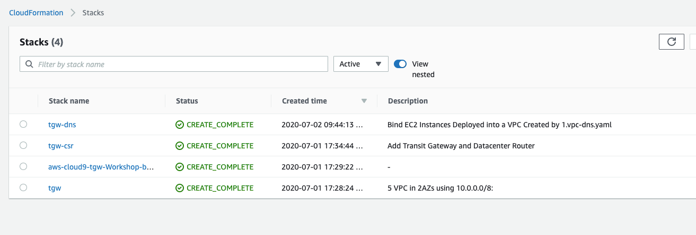

# DNS Deployment

Run the CloudFormation template 3.tgw-dns.yaml to deploy the Bind server in the DataCenter VPC as well as the remaining AWS Route53 components

 

<b>HOW TO Deploy the Bind Server</b> 

1. Click on the CloudFormation Launch link below that corresponds to the AWS Region in which you deployed the first stack:

   
 

1. Give the stack a name, enter the name of your first stack (must be entered accurately) and select a DNS compliant domain name, such as **kneetoe.com**. Click **Next**.
   

1. For **Configuration stack options** we don't need to change anything, so just click **Next** at the bottom right.

1. Scroll down to the bottom of the **Review name_of_your_stack** and check the **I acknowledge that AWS CloudFormation might create IAM resources with custom names.** Click the **Create** button in the lower right.
   

1. Wait for the Stack to show **Create_Complete**.
   