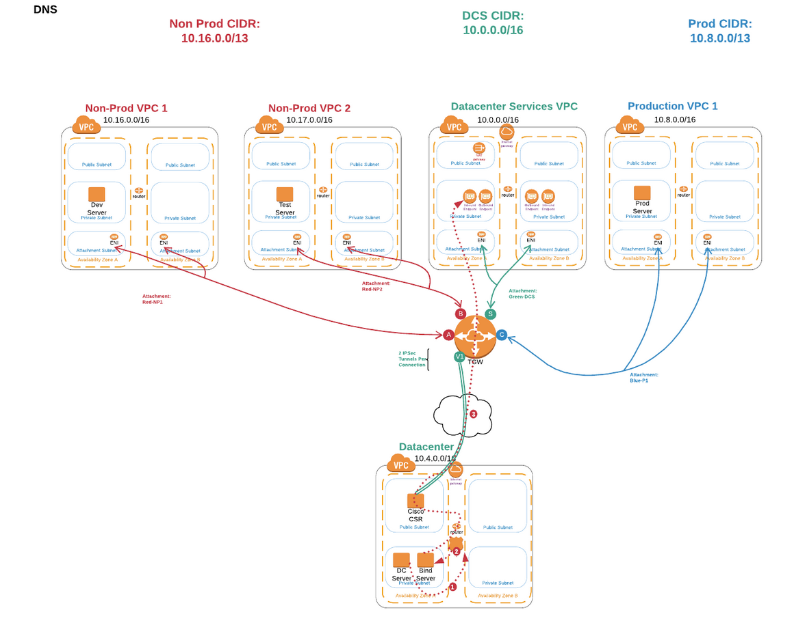
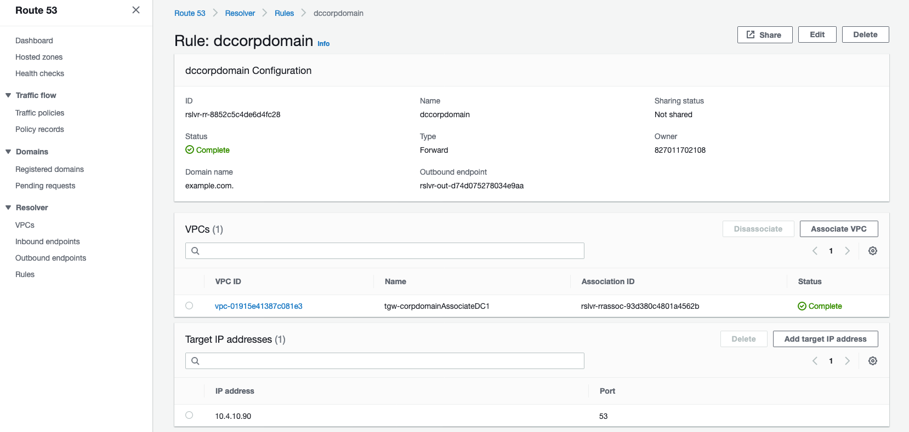
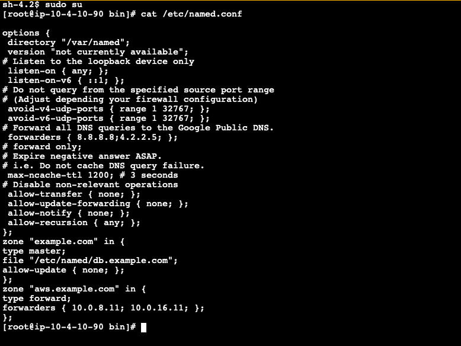
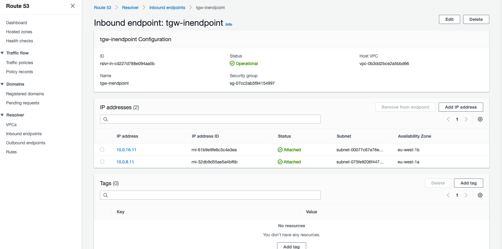
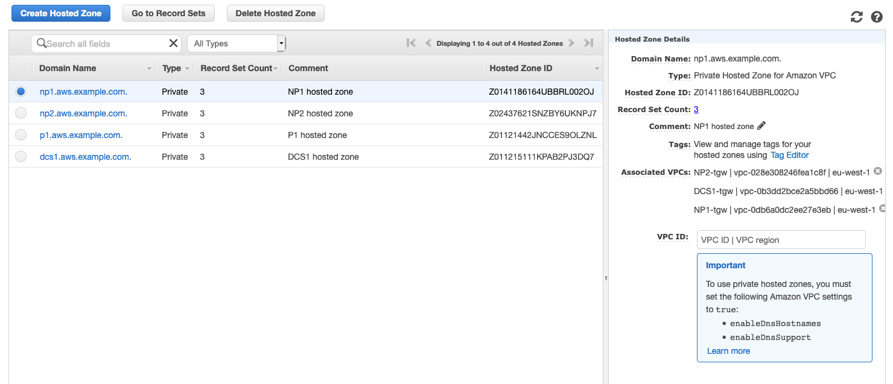
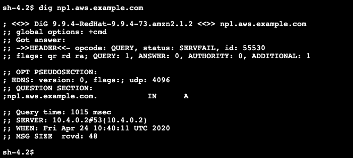
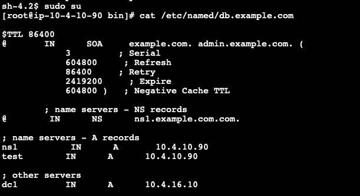
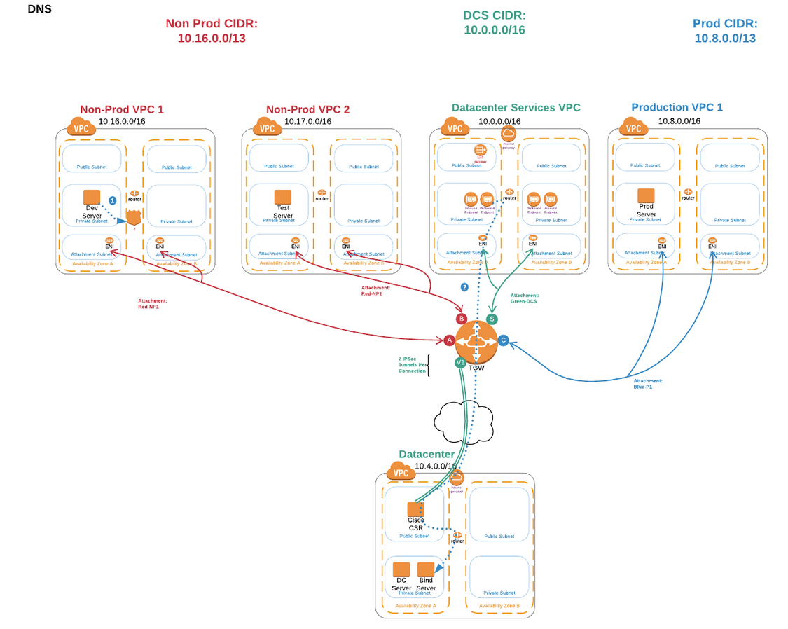
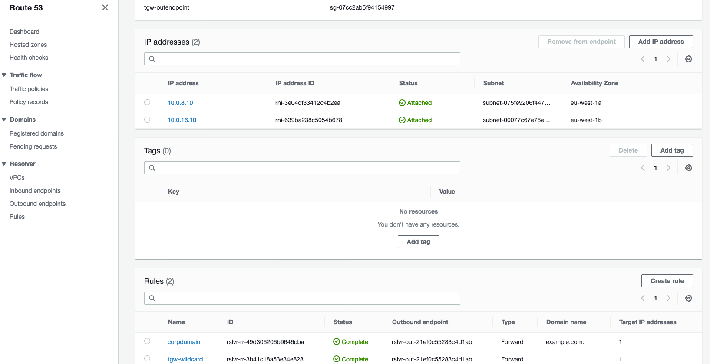
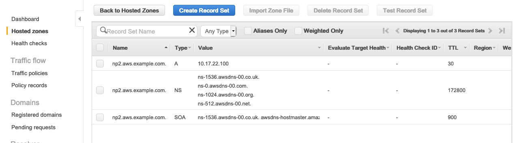

# DNS Testing


## DNS Between Datacenter and VPCs

1. In the AWS Management Console choose **Services** then select **Systems Manager**.

1. From the menu on the left, scroll down and select **Session Manager**. Session Manager allows us to use IAM roles and policies to determine who has console access without having to manage ssh keys for our instances.

1. In the main pane, click the **Start session** button. Pick the DataCenter Instance to shell into. You will now enter a bash shell prompt for that instance.

1. Let's ping np1.aws._your_domain_name_. Every one second or so, you should see a new line showing the reply and roundtrip time.

	```
	sh-4.2$ ping np1.aws.example.com
	PING 10.16.18.220 (10.16.18.220) 56(84) bytes of data.
	64 bytes from 10.16.18.220: icmp_seq=1 ttl=254 time=1.09 ms
	64 bytes from 10.16.18.220: icmp_seq=2 ttl=254 time=0.763 ms
	64 bytes from 10.16.18.220: icmp_seq=3 ttl=254 time=0.807 ms
	64 bytes from 10.16.18.220: icmp_seq=4 ttl=254 time=0.891 ms
	64 bytes from 10.16.18.220: icmp_seq=5 ttl=254 time=0.736 ms
	64 bytes from 10.16.18.220: icmp_seq=6 ttl=254 time=0.673 ms
	64 bytes from 10.16.18.220: icmp_seq=7 ttl=254 time=0.806 ms
	^C
	+++ 10.16.18.220 ping statistics +++
	7 packets transmitted, 7 received, 0% packet loss, time 6042ms
	rtt min/avg/max/mdev = 0.673/0.824/1.096/0.130 ms
	```

1. You can also try to resolve any other Route 53 hosted domain like np2.aws._your_domain_name_ or p1.aws._your_domain_name_. Feel free to use **dig DomainName** for testing as well

1. _Attaching our diagram for reference._ How is this actually working? Let's take a closer look

	

1. In the AWS Management Console choose **Services** then select **Route 53**.

1. From the menu on the left, scroll down and select **Outbound Endpoints**. Pick the one with the name **tgw-dns-dc1outendpoint**

1. This Outbound Endpoint is configured within the DataCenter VPC. Its mission is forwarding requests for the domain "example.com" to the Bind DNS server within the VPC. In a real environment with an on-premise DNS server and regular servers, DNS requests would land on the DNS server on their own so this Outbound Endpoint wouldn't be needed.

1. Once in the Outbound Endpoint menu, scroll down and select **Rules**. This rule satisfies the condition just mentioned for the domain "example.com":

	

1. Moving on to the configuration in the DNS Bind Server, the CloudFormation template deployed a very simple configuration to just forward "aws.example.com" requests to the DNS Inbound Endpoints in the DataCenter Services VPC, crossing the VPN connection. The Bind server is also hosting the zone "example.com" itself. You can check the configuration by logging into the DNS Bind Server using **Systems Manager** and checking the configuration file:

	

1. There is an Inbound Endpoint within the DCS1 VPC to receive requests intended for AWS: 

	

1. This endpoint, present within the DCS1 VPC, will receive external DNS queries and resolve them based on the Private Hosted Zones associated with the DCS1 VPC. For Route53, the DCS1 VPC is acting as a sort of "transit" VPC. Any Private Hosted Zone associated with this VPC will be visible for the Inbound Endpoint. Note that you don't explicitely need connectivty between the DCS1 VPC and the other VPCs associated with the Route53 Private Hosted Zone. AWS takes care of that behind the scenes. Following the examble above, the DNS request for "np1.example.com" would be resolved as such (see the VPCs associated with this Private Hosted Zone at the right):
	
	


 <details>
 <summary><p style="color:blue"><b>Lab #3 - QUESTION 1 </b><i>(Click to see the answer)</i></p>
  <b>What would happen if you dissasociate the "np1.aws.example.com" hosted zone with the DCS1 VPC?</b></br>
  </summary><p>
  The Inbound Endpoint won't be able to resolve "np1.aws.example.com" anymore as this endpoint is located within the DCS1 VPC and we have just removed the association between the NP1 Private Hosted Zone and the DCS1 VPC. As a result, we won't be able to resolve the DNS domain from our DataCenter server:<p>
  
 </details>


</br>
</br>
</br>


## DNS Between VPCs and Datacenter


1. Let's look at the Bind Server configuration again. The Private Hosted Zone "example.com" contains a domain name "test.example.com". Let's use it for our testing:

	

1. Log into one of the VPC endpoint instances using **Systems Manager**. We will use NP1. Issue a dig to confirm the DNS resolution is working:

	```
	sh-4.2$ dig test.example.com

	; <<>> DiG 9.9.4-RedHat-9.9.4-73.amzn2.1.2 <<>> test.example.com
	;; global options: +cmd
	;; Got answer:
	;; ->>HEADER<<- opcode: QUERY, status: NOERROR, id: 5022
	;; flags: qr rd ra; QUERY: 1, ANSWER: 1, AUTHORITY: 0, ADDITIONAL: 1

	;; OPT PSEUDOSECTION:
	; EDNS: version: 0, flags:; udp: 4096
	;; QUESTION SECTION:
	;test.example.com.              IN      A

	;; ANSWER SECTION:
	test.example.com.       60      IN      A       10.4.10.90

	;; Query time: 4 msec
	;; SERVER: 10.4.0.2#53(10.4.0.2)
	;; WHEN: Fri Apr 24 11:03:26 UTC 2020
	;; MSG SIZE  rcvd: 61
	```

1. _Attaching our diagram for reference again._ How is this actually working? Let's take a closer look:

	

1. As "test.example.com" is not hosted within the Private Hosted Zone attached to the VPC, the DNS request will land in the Outbound Endpoint

1. In the AWS Management Console choose **Services** then select **Route 53**.

1. From the menu on the left, scroll down and select **Outbound Endpoints**. Pick the one with the name **tgw-outendpoint**. If you scroll down and theck the rules, you will see 2 rules configured. The first one is the "match" in this case and it will forward the traffic to the Bind Server within the DataCenter VPC:

	


</br>
</br>
</br>


## Troubleshooting Tips and additional info

If you are not able to successfully use **dig** and **ping** using DNS names, make sure you completed all the routing changes in the previous module.

### DCS1 Private Subnet Routing Problem

If you did not add a 10.0.0.0/8 route to the TGW for the DCS1 Private subnet, Route53 Resolver Endpoints will return traffic through the NAT gateway instead of directly back. Since the requester did not also go through the NAT gateway traffic will be dropped by the requesting host without looking at the response. You can see that here:
`dig np1.aws.farout.com @10.0.8.11 ;; reply from unexpected source: 10.0.2.48#60358, expected 10.0.8.11#53`

### Bind Server

If you want to see what requests are passing through the Bind server, you can monitor the log messages. First turn on query logging and then tail the log message file:

```
# sudo rndc querylog

# sudo tail -f /var/log/messages
```

Now, leave that session up in a browser tab. From another tab, use session manager to have the DC1 Server attempt to ping np1.aws._your_domain_name_ and check back at this screen:

```
eb  7 11:30:50 ip-10-4-15-234 named[3689]: client 10.4.14.53#42094 (np1.aws.farout.com): query: np1.aws.farout.com IN A +ED (10.4.15.234)
```


 <details>
 <summary><p style="color:blue"><b>Lab #3 - QUESTION 2 </b><i>(Click to see the answer)</i></p>
  <b>NOTE: Please enable real-time logging in the Bind DNS server as instructed above for this question.</br>
  Log into the DataCenter server via terminal and issue a dig command for "np2.aws.example.com". Wait 15 seconds and repeat the operation. Why do you just see a single entry in the log despite issuing 2 separate DNS queries?</b></br>
  </summary><p>
  It's all about DNS ttl. The "np2.aws.example.com" domain is hosted within a Private Hosted Zone in Route 53. There is a 30 second TTL value defined for this domain. The Bind Server will honor that and won't send further queries for the domain until the TTL is expired.<p>
  
 </details>


