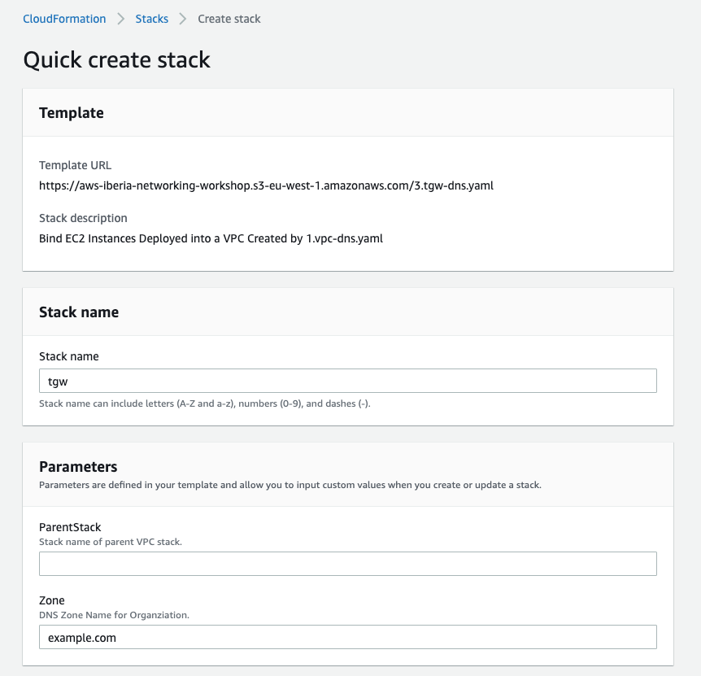
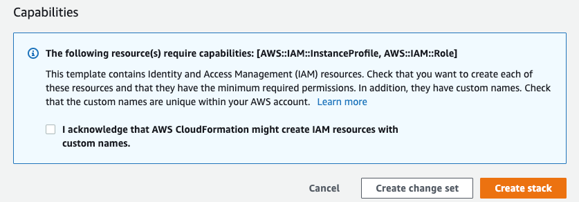
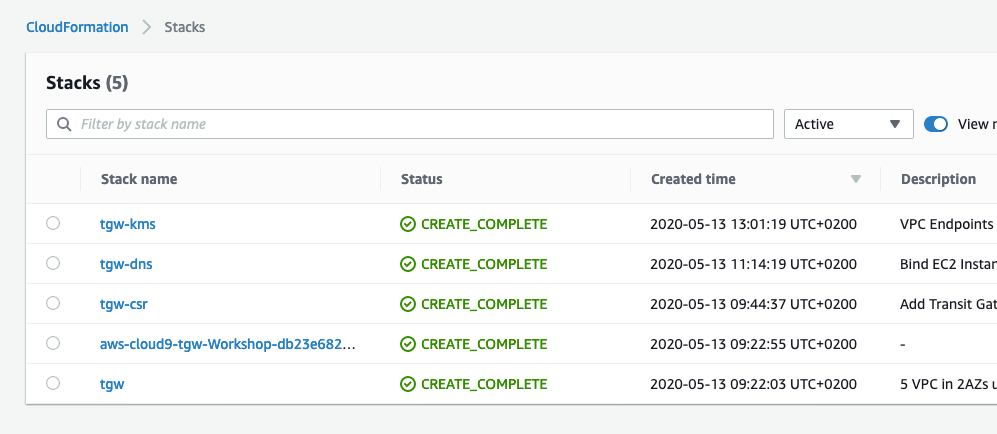

# VPC Endpoints - Deployment

This CloudFormation stack deploys a KMS VPC endpoint within the **DCS1** VPC as well as a Route53 Private Zone for the endpoint:

1. Click on the CloudFormation Launch link below that corresponds to the AWS Region in which you deployed the first stack.

   
 
1. For the **Specify stack details** give the stack a name, enter the name of your first stack (must be entered exactly to work). Click **Next**.
   

1. Scroll down to the bottom of the **Review name_of_your_stack** and check the **I acknowledge that AWS CloudFormation might create IAM resources with custom names.** Click the **Create** button in the lower right.
   

1. Wait for the Stack to show **Create_Complete**
   