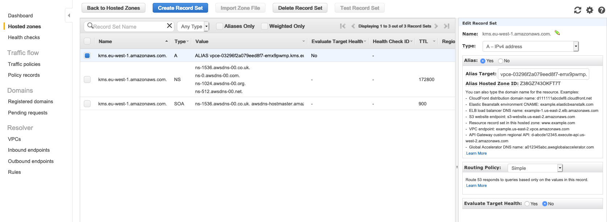
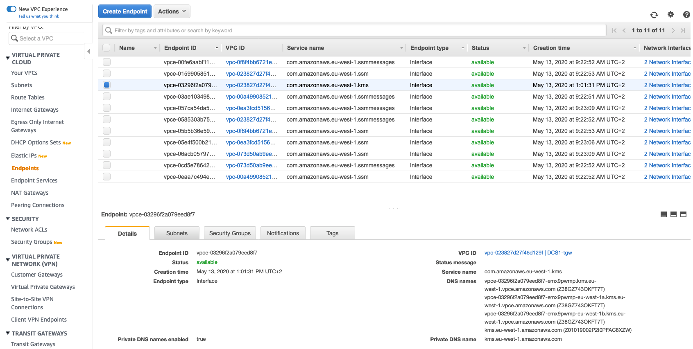

# NP2 Endpoint Testing

1. In the AWS Management Console choose **Services** then select **Systems Manager**.

1. From the menu on the left, scroll down and select **Session Manager**. Session Manager allows us to use IAM role and policies to determine who has console access without having to manage ssh keys for our instances.

1. In the main pane, click the **Start session** button. Pick The NP2 Instance to shell into. You will now enter a bash shell prompt for that instance.

1. Lets dig "kms._your_region_.amazonaws.com" you should get a response with two 10.0.x.x addresses (make sure you pick the right region).

	```
	sh-4.2$ dig kms.us-east-2.amazonaws.com

	; <<>> DiG 9.9.4-RedHat-9.9.4-61.amzn2.1.1 <<>> kms.us-east-2.amazonaws.com
	;; global options: +cmd
	;; Got answer:
	;; ->>HEADER<<- opcode: QUERY, status: NOERROR, id: 37063
	;; flags: qr rd ra; QUERY: 1, ANSWER: 2, AUTHORITY: 0, ADDITIONAL: 1

	;; OPT PSEUDOSECTION:
	; EDNS: version: 0, flags:; udp: 4096
	;; QUESTION SECTION:
	;kms.us-east-2.amazonaws.com.   IN      A

	;; ANSWER SECTION:
	kms.us-east-2.amazonaws.com. 60 IN      A       10.0.20.149
	kms.us-east-2.amazonaws.com. 60 IN      A       10.0.13.161

	;; Query time: 3 msec
	;; SERVER: 10.17.0.2#53(10.17.0.2)
	;; WHEN: Thu Mar 14 11:26:44 UTC 2019
	;; MSG SIZE  rcvd: 88
	```

1. This is working as expected. Let's take a look at what's going on...

1. In the AWS Management Console choose **Services** then select **Route 53**.

1. At the left, select **Hosted Zones** and then click the **kms.yourRegion.amazonaws.com.** hosted zone

1. If you take a look at the center, there is a type A record set provisioned. If you select the record set, you can see it's pointing any DNS query to "kms.eu-west-1.amazonaws.com" towards the VPC Endpoint named "vpce-.......".


1. Now let's find out who that VPC Endpoint is

1. In the AWS Management Console choose **Services** then select **VPC**.

1. At the left, select **Endpoints** and locate the VPC Endpoint related to KMS


1. At the bottom right, you can see all the DNS alias available for your VPC endpoint. The first one, which is not tied to any Availability Zone, is the one being used by the Route 53 record seen before. The other DNS names refer to the ENIs placed by the VPC Endpoint on each Availability Zone as you might want to use specific Availability Zones for your VPC Endpoints (to avoid inter-AZ traffic)


