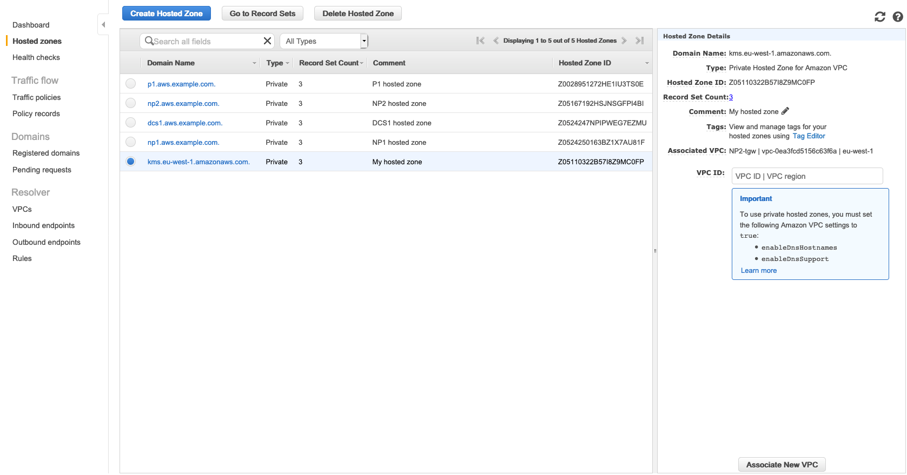

# NP1 Endpoint Testing

The NP1 VPC resources also want to benefit from the VPC Endpoint. However, see what happens whenever you try to resolve the KMS DNS name from the NP1 VPC:

1. Use **Session Manager** again and shell into NP1. Use dig to lookup kms._your_region_.amazonaws.com (make sure you pick the right region)

```
sh-4.2$ dig kms.us-east-2.amazonaws.com

; <<>> DiG 9.9.4-RedHat-9.9.4-61.amzn2.1.1 <<>> kms.us-east-2.amazonaws.com
;; global options: +cmd
;; Got answer:
;; ->>HEADER<<- opcode: QUERY, status: NOERROR, id: 7263
;; flags: qr rd ra; QUERY: 1, ANSWER: 1, AUTHORITY: 0, ADDITIONAL: 1

;; OPT PSEUDOSECTION:
; EDNS: version: 0, flags:; udp: 4096
;; QUESTION SECTION:
;kms.us-east-2.amazonaws.com.   IN      A

;; ANSWER SECTION:
kms.us-east-2.amazonaws.com. 44 IN      A       52.95.18.38

;; Query time: 1 msec
;; SERVER: 10.16.0.2#53(10.16.0.2)
;; WHEN: Thu Mar 14 11:40:34 UTC 2019
;; MSG SIZE  rcvd: 72

sh-4.2$

```


<details>
 <summary><p style="color:blue"><b>Lab #4 - QUESTION 1 </b><i>(Click to see the answer)</i></p>
  <b>We are getting a public ip for the KMS service within the NP1 VPC. What's missing?</b></br>
  </summary><p>
	- You probably got it right. The packet is not being routed to the VPC Endpoint because the DNS query for **kms._your_region_.amazonaws.com** is resolving to the regular KMS public ip. </br> 
	- How can we fix that? Quite simple, just associate the Route53 Private Hosted Zone with the NP1 VPC as well

1. In the AWS Management Console choose **Services** then select **Route53**.

1. In the main panel, click circle to the left of the Domain Name **kms._your_region_.amazonaws.com**

1. In the far right panel, click the text box **VPC ID** and find the NP1 VPC in the list under the region you created your VPCs.

1. Click the bottom-right button, **Associate New VPC**

	

1. Now repeat the test from the NP1 instance (note the change might take a couple of minutes to propagate)

```
sh-4.2$ dig kms.us-east-2.amazonaws.com

; <<>> DiG 9.9.4-RedHat-9.9.4-61.amzn2.1.1 <<>> kms.us-east-2.amazonaws.com
;; global options: +cmd
;; Got answer:
;; ->>HEADER<<- opcode: QUERY, status: NOERROR, id: 37063
;; flags: qr rd ra; QUERY: 1, ANSWER: 2, AUTHORITY: 0, ADDITIONAL: 1

;; OPT PSEUDOSECTION:
; EDNS: version: 0, flags:; udp: 4096
;; QUESTION SECTION:
;kms.us-east-2.amazonaws.com.   IN      A

;; ANSWER SECTION:
kms.us-east-2.amazonaws.com. 60 IN      A       10.0.20.149
kms.us-east-2.amazonaws.com. 60 IN      A       10.0.13.161

;; Query time: 3 msec
;; SERVER: 10.17.0.2#53(10.17.0.2)
;; WHEN: Thu Mar 14 11:26:44 UTC 2019
;; MSG SIZE  rcvd: 88
```

</details>


