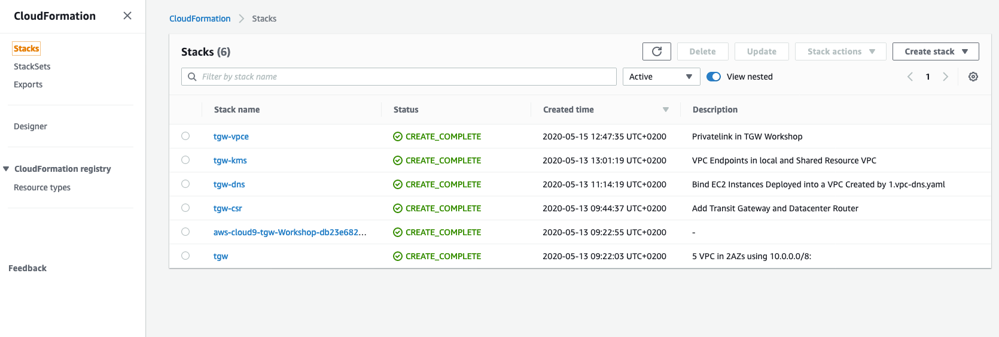

# VPC Endpoint Services - Deployment

This CloudFormation stack deploys:
- A web application within the **NP2** VPC hosted behind an internal Network Load Balancer
- A new Route53 Record set for the DNS domain "web.np2.aws.YourDomainName". Note that "YourDomainName" is the one you selected during Lab#3. This DNS name points to the Network Load Balancer
- A new VPC CIDR 100.x.x.x for the **NP2** VPC. This new VPC CIDR is used for the new EC2 instances and the Network Load Balancer

1. Click on the CloudFormation Launch link below that corresponds to the AWS Region in which you deployed the first stack.

   
   
 
1. Give the stack a meaningful name or accept the name given. Make sure the Parent Stack name is correct. Leave the "Subnets" section with "Yes". Click **Next**.

1. Scroll down to the bottom of the **Review name_of_your_stack** and check the **I acknowledge that AWS CloudFormation might create IAM resources with custom names.** Click the **Create** button in the lower right.
   
   

1. Wait for the Stack to show **Create_Complete**
   

