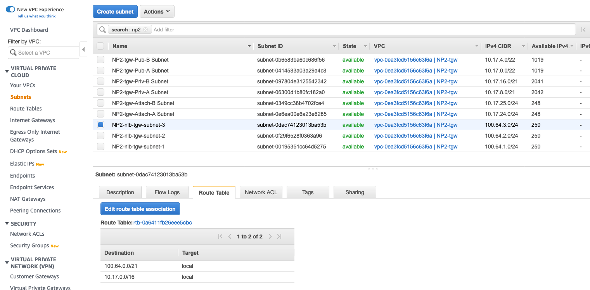
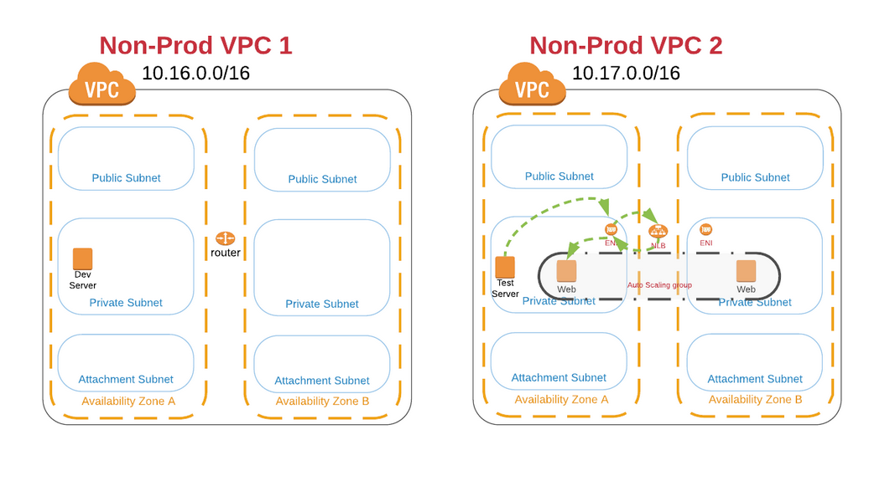
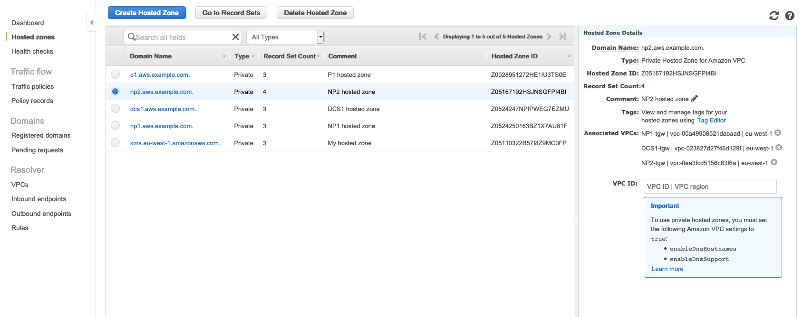
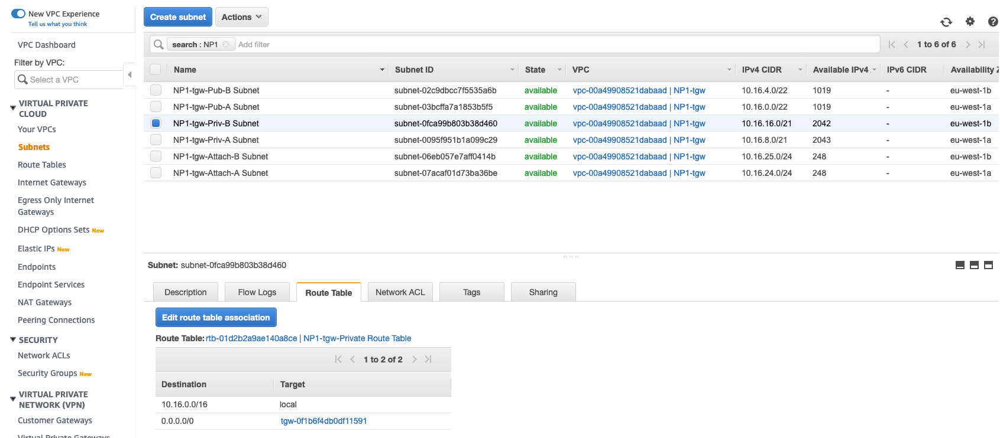
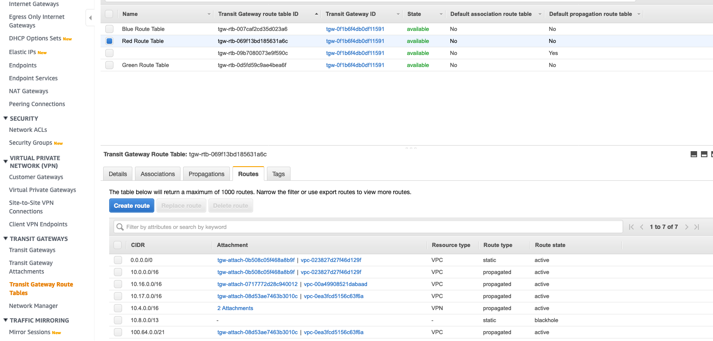

# Application and Load Balancer testing

**Verify connectivity to the new app**

1. In the AWS Management Console choose **Services** then select **Systems Manager**.

1. From the menu on the left, scroll down and select **Session Manager**. Session Manager allows us to use IAM role and policies to determine who has console access without having to manage ssh keys for our instances.

1. In the main pane, click the **Start session** button. Pick The NP2 Instance to shell into. You will now enter a bash shell prompt for that instance.

1. Try to curl web.np2.aws._your_domain_name_. You should get a response from one of the two instances in the Load Balancer Autoscaling Group which is in the Target Group:

```
Welcome to my web server. Server private IP is 10.17.23.165
Availability Zone: us-west-2b
Stack Name: tgw2
your ip is 10.17.18.25
```

Let's check what has just happened:
- An internal load balancer DNS name will always return ips within the VPC subnets it resides, which correspond to the ENIs placed in the subnet:

```
sh-4.2$ curl web.np2.aws.example.com
Welcome to my web server. Server private IP is 10.17.14.144
Availability Zone: eu-west-1a
Stack Name: tgw
your ip is 10.17.22.100
sh-4.2$ dig web.np2.aws.example.com

; <<>> DiG 9.9.4-RedHat-9.9.4-73.amzn2.1.2 <<>> web.np2.aws.example.com
;; global options: +cmd
;; Got answer:
;; ->>HEADER<<- opcode: QUERY, status: NOERROR, id: 17291
;; flags: qr rd ra; QUERY: 1, ANSWER: 3, AUTHORITY: 0, ADDITIONAL: 1

;; OPT PSEUDOSECTION:
; EDNS: version: 0, flags:; udp: 4096
;; QUESTION SECTION:
;web.np2.aws.example.com.       IN      A

;; ANSWER SECTION:
web.np2.aws.example.com. 60     IN      A       100.64.1.33
web.np2.aws.example.com. 60     IN      A       100.64.2.162
web.np2.aws.example.com. 60     IN      A       100.64.3.143

;; Query time: 3 msec
;; SERVER: 10.17.0.2#53(10.17.0.2)
;; WHEN: Fri May 15 15:25:04 UTC 2020
;; MSG SIZE  rcvd: 100
```


- On the other hand, whenever you provision a new VPC CIDR, you split it into different subnets (as you would do whenever you create a VPC). By default, these subnets are able to route traffic to any other VPC CIDR:



- Thus, as the EC2 instance you are using for testing is positioned in a subnet "direcly connected" to the internal Network Load Balancer, the traffic is able to reach the application easily, as noted in the diagram below:




<details>
 <summary><p style="color:blue"><b>Lab #5 - QUESTION 1 </b><i>(Click to see the answer)</i></p>
  <b>If you log into the NP1 instance and you try to resolve the same DNS domain (dig "web.np2.aws._your_domain_name_")...will that work?</b></br>
  </summary><p>
Yep, it should work. Try it yourself logging into the NP1 instance via **Systems Manager**:

```
sh-4.2$ dig web.np2.aws.example.com

; <<>> DiG 9.9.4-RedHat-9.9.4-73.amzn2.1.2 <<>> web.np2.aws.example.com
;; global options: +cmd
;; Got answer:
;; ->>HEADER<<- opcode: QUERY, status: NOERROR, id: 5376
;; flags: qr rd ra; QUERY: 1, ANSWER: 3, AUTHORITY: 0, ADDITIONAL: 1

;; OPT PSEUDOSECTION:
; EDNS: version: 0, flags:; udp: 4096
;; QUESTION SECTION:
;web.np2.aws.example.com.       IN      A

;; ANSWER SECTION:
web.np2.aws.example.com. 36     IN      A       100.64.1.33
web.np2.aws.example.com. 36     IN      A       100.64.2.162
web.np2.aws.example.com. 36     IN      A       100.64.3.143

;; Query time: 1 msec
;; SERVER: 10.16.0.2#53(10.16.0.2)
;; WHEN: Fri May 15 14:06:03 UTC 2020
;; MSG SIZE  rcvd: 100

```

The reason being is that the same Route53 Internal Zone is also associated with the NP1 VPC so the DNS domain "web.np2.aws._your_domain_name_" is also visible from that VPC:


</details>


<details>
 <summary><p style="color:blue"><b>Lab #5 - QUESTION 2 </b><i>(Click to see the answer)</i></p>
  <b>What if you try to access the application from that same NP1 instance? Will that work also?</b></br>
  </summary><p>
This is a tough question and you can inmediately see the request timing out:

```
sh-4.2$ curl web.np2.aws.example.com


^C
sh-4.2$

```
It won't work because there is no routing configured all the way down between the NP1 instance (source) and the NP2 WebServer instance (the eventual destination after crossing the load balancer).

If we check step by step:
- The request leaves the NP1 instance and it's routed to the Transit Gateway based on the routing table associated to the subnet, following the default route 0.0.0.0:
	

- It lands in the Red Routing Table in the Transit Gateway. A new routing lookup takes place and the request gets forwarded towards the NP2 VPC following the 100.64.x.x route. *Note it was learned automatically when we provisioned the new VPC CIDR*
	

- Once in the destination, there is no route back towards the source network 10.16.x.x. The packet gets dropped
	

</details>


