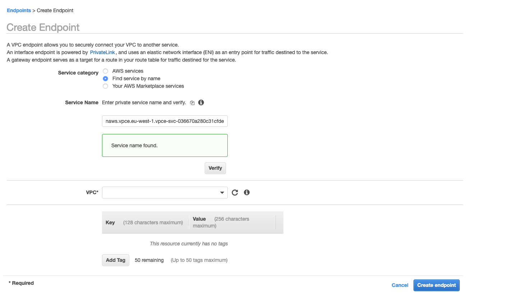
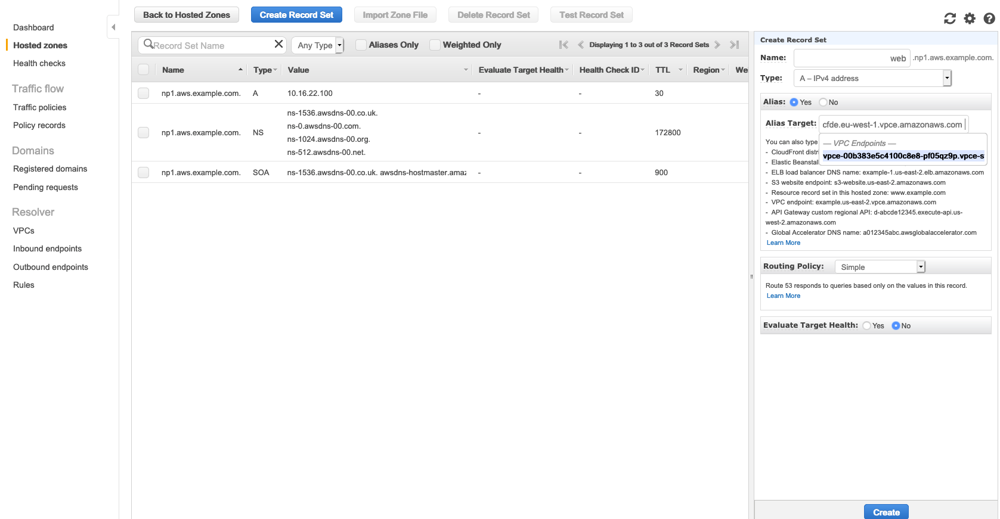

# Create VPC Endpoint

**VPC Endpoint creation**

Let's now create a VPC Endpoint within the **NP1 VPC** so we can consume the Endpoint Service created before:

1. In the AWS Management Console choose **Services** then select **VPC**.

1. From the menu on the left, scroll down and select **Endpoints**. Endpoints allow us to connect our VPC to another service. In the previous lab we created an endpoint to an AWS service. Now we will connect to our own **Endpoint Service**.

1. In the main pane, click the **Create Endpoint** button.

1. For **Service catagory**, select **Find service by name**.

1. For **Service Name**, paste the name recorded in the final step of the last module. *Note: this is available in the "Endpoint Service" details*. Click **Verify**. In a few seconds, you should see **Service name found.**
	

1. For **VPC** select the VPC with **NP1** in the name.

1. Subnets options will now show up. Be sure to select the *Priv** subnets for each **Availablity Zone**. Even though the **Endpoint Service** is available in every Availability Zone, the **NP1** VPC is only in two, so we only have two.

1. For **Security Group**, select the security group with **NP1** and **Web** in the name. This **Security Group** was created by the Cloudformation template and allows traffic from any internal IP (10.0.0.0/8) to TCP port 80 (HTTP).

1. Click the **Create endpoint** button at the bottom of the page. 

1. After a few minutes the **Status** of the endpoint will change from **pending** to **available**.

 

 

**Create a familiar DNS name in Route53 for the Endpoint**

Several DNS names will be created for the **Endpoint**. They will start with **vpce** and end with **amazonaws.com**. The first one listed under **DNS Names** in the Details tab will return an Interface IP address for each Availability Zone that is active. The other names will be availability zone specific and include the availability zone in the name, such as us-west-2**a** or us-west-2**b**. These only return 1 IP address for that Availability Zone.

Lets create a more friendly name:

1. From the details of the **Endpoint** note (or copy) the first DNS Name listed. *Note: dont include the ZoneID listed in parentesis or any spaces*. We will reference this as a DNS alias a few steps down.

1. In the AWS Management Console choose **Services** then select **Route 53**.

1. From the menu on the left, scroll down and select **Hosted Zones**.

1. From the list of Hosted Zones click on the Domain Name of the **np1.aws.YourDomainName** 

1. In the main panel, click the **Create Record Set** button.

1. In the right-hand panel, enter a name for the Endpoint such as **web**. This will be appended by the np1. domain

1. Select **Type A** and set **Alias** to **Yes**.

1. For Alias Target, paste the DNS name recorded in the first step above, and then select the value from the list.
	

