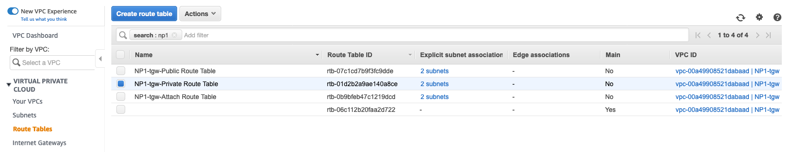
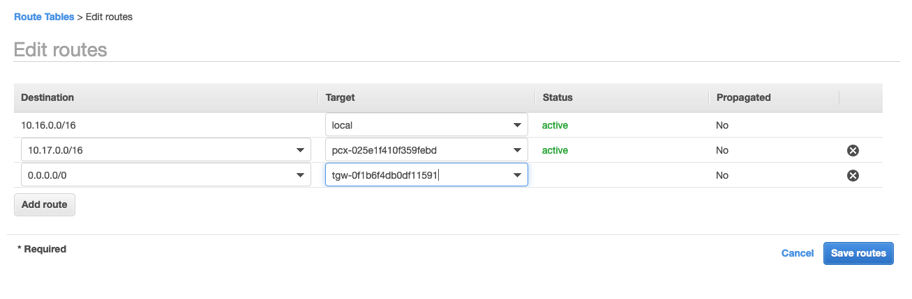
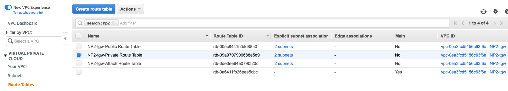
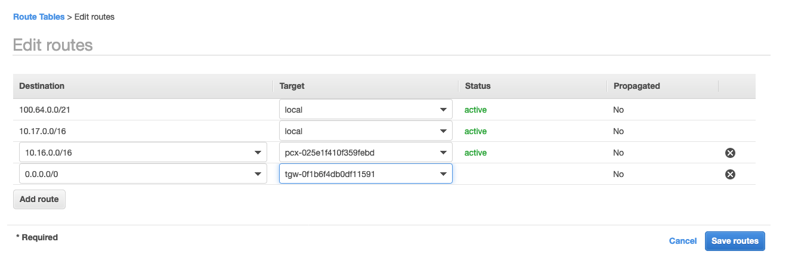

# Routing Configuration

As a last step we need to configure routing on both ends so traffic destined to the peered VPC is effectively routed through the VPC peering connection

**Configuring VPC Routing - NP1 Private Subnets**

1. In the AWS Management Console choose **Services** then select **VPC**.

1. From the menu on the left, scroll down and select **Route Tables**. Route Tables are associated with Subnets. In this case we are interested in the NP1 Private Subnets and the route table associated with those two subnets.

1. In the main pane, type in a filter **NP1** and check the box next to the **NP1-*Stack_Name*-Private Route Table** line item. *Be sure to select the Private route table for the NP1 VPC*
	

1. From the **Actions** button, select **Edit Routes**. We are going to add a route to just the two NP2 Private Subnets

1. From the **Edit Routes** pane, Click the **Add Route** button and add the following entry:
Destination: 10.17.0.0/16  
Target: *Select **Peering Connection**  and from the drop down list select the peering connection (should only be one in the lab)*

1. Also, remove the default route 0.0.0.0/0 to make sure we don't use the Transit Gateway

1. Click **Save Routes** at the bottom right.
	
	

**Configuring VPC Routing - NP2 Private Subnets**

1. In the AWS Management Console choose **Services** then select **VPC**.

1. From the menu on the left, scroll down and select **Route Tables**. Route Tables are associated with Subnets. In this case we are interested in the NP2 Private Subnets and the route table associated with those two subnets.

1. In the main pane, type in a filter **NP2** and check the box next to the **NP2-*Stack_Name*-Private Route Table** line item. *Be sure to select the Private route table for the NP2 VPC*
	

1. From the **Actions** button, select **Edit Routes**. We are going to add a route to just the two NP1 Private Subnets

1. From the **Edit Routes** pane, Click the **Add Route** button and add the following entry:
Destination: 10.16.0.0/16  
Target: *Select **Peering Connection**  and from the drop down list select the peering connection (should only be one in the lab)*

1. Also, remove the default route 0.0.0.0/0 to make sure we don't use the Transit Gateway

1. Click **Save Routes** in the bottom right.

	

