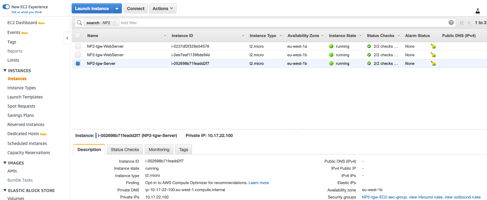

# Final Testing

1. In the AWS Management Console choose **Services** then select **Systems Manager**.

1. From the menu on the left, scroll down and select **Session Manager**. Session Manager allows us to use IAM role and policies to determine who has console access without having to manage ssh keys for our instances.

1. In the main pane, click the **Start session** button. Pick the **NP1 Instance** to shell into. You will now enter a bash shell prompt for that instance.

1. Let's try to ping the EC2 instance located within the **NP2 Private Subnet**. You can get the NP2 instance ip from the EC2 section:
	

1. The ICMP ping should succeed:

```
sh-4.2$ ping 10.17.22.100
PING 10.17.22.100 (10.17.22.100) 56(84) bytes of data.
64 bytes from 10.17.22.100: icmp_seq=1 ttl=255 time=0.362 ms
64 bytes from 10.17.22.100: icmp_seq=2 ttl=255 time=0.437 ms
64 bytes from 10.17.22.100: icmp_seq=3 ttl=255 time=0.412 ms
64 bytes from 10.17.22.100: icmp_seq=4 ttl=255 time=0.489 ms
^C
--- 10.17.22.100 ping statistics ---
4 packets transmitted, 4 received, 0% packet loss, time 3063ms
rtt min/avg/max/mdev = 0.362/0.425/0.489/0.045 ms
sh-4.2$
```
