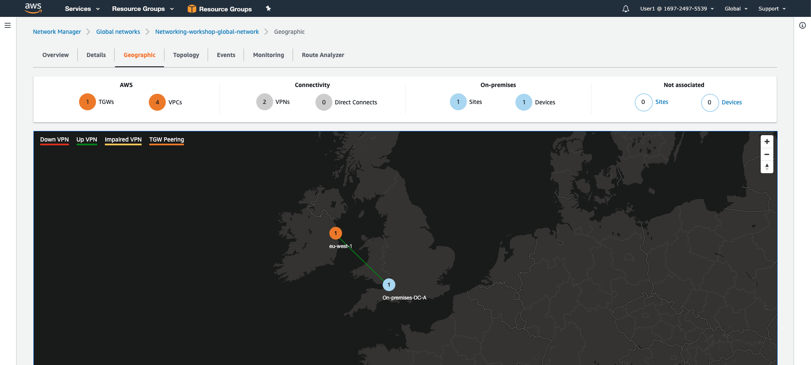

# AWS Transit Gateway Network Manager Overview

As we build out our networking infrastructure on AWS it is important that we understand our network topology and monitor its performance and reliability. AWS Transit Gateway network manager provides a single global view of your private network. This enables you to visualize your global network in a topology diagram and in a geographical map. You can then review utilization metrics, such as bytes in/out, packets in/out, packets dropped, and alerts for changes in the topology, routing, and up/down connection status. 

Below is example of a dynamically created map based on the components (such as devices and links) that make up your network.

