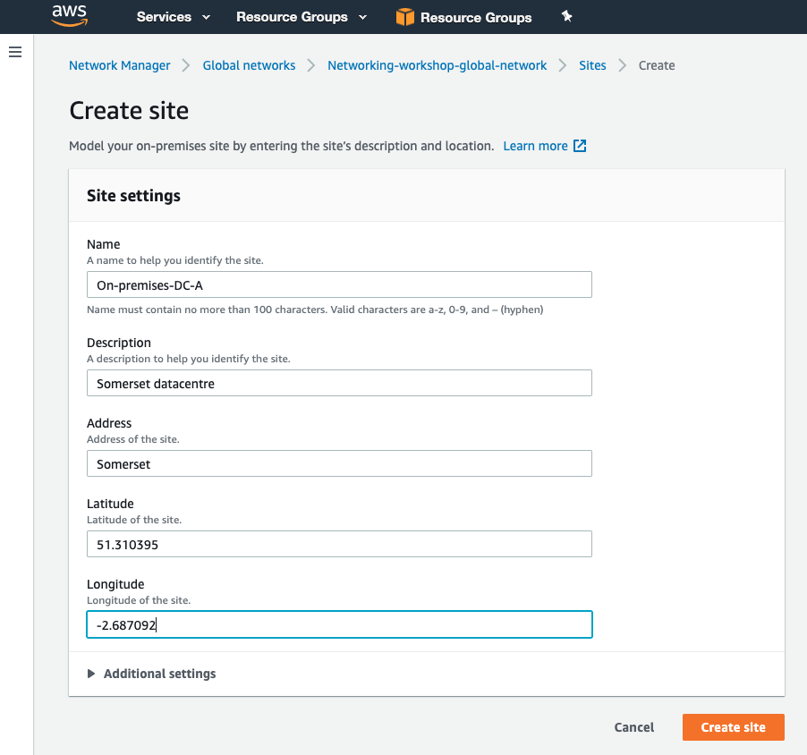
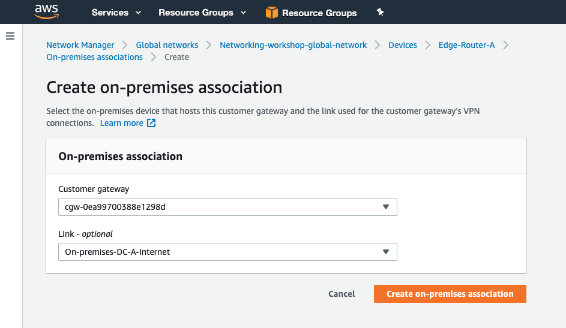

# Network Manager Site configuration

To help build a graphical picture of your global infrastructure we need to supply network manager with some additional details about your on-premesis infrastructure. In this section we will create the following resources:

- Site - This contains information about the physical sites we are connecting into AWS.
- Link - This contains details a bout the link capabilites we are using to connect to AWS.
- Devices - This stores details about the devices we are using to terminate our network connections to AWS.

### Create a Site

1. In the AWS Management Console change to the region you are working in. This is in the upper right hand drop down menu.

2. In the AWS Management Console choose **Services** then select **VPC**.

3. From the left-hand menu select **Network Manager**. _It's near the bottom, in the **Transit Gateways** section._

4. Click **View my Global Networks** in the main panel.

5. Select the global network you just created.

6. Click **Sites** in the left-hand menu under *On-Premises*.

7. Click **Create Site** in top right and enter the following details:
   Name: On-premises-DC-A
   Description: Somerset datacentre
   Address: Somerset
   Latitude: 51.310395
   Longitude: -2.687092

   Click **Create Site**
   

8. Click into the newly created site and click on the *Links* tab.

9. Click **Create Link** and add the following details:
   Name: On-premises-DC-A-Internet
   Description: Somerset datacentre internet link
   Upload speed (Mbps): 1000
   Download speed (Mbps): 1000
   Provider: Awesome-ISP
   Type: Broadband
   
   Click **Create Link**

10. Click **Devices** in the left-hand menu under *On-Premises*.

11. Click **Create device** in top right and enter the following details:
   Name: Edge-Router-A
   Description: Edge router-A Somerset
   Model: CSR1000V
   Serial Number: 123456789
   Type: Router
   Vendor: Cisco
   Address: Somerset
   Latitude: 51.310395
   Longitude: -2.687092

   Click **Create device**

11. Click into the newly created device. From the right hand side click **Associate site** and select the site we just created from the drop down. Click **Edit site association**.

12. Click the **On-premises associations** tab and **Associate**. Under **Customer Gateway** select the cgw and under **Link** select the link we created earlier. Click **Create on-premises association**.
    

We have now added our on-premises information which will enable us to build our topology.
