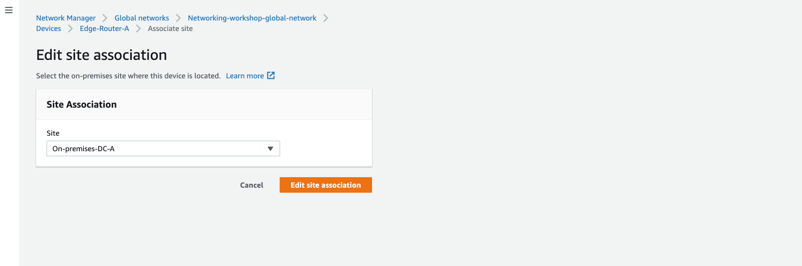
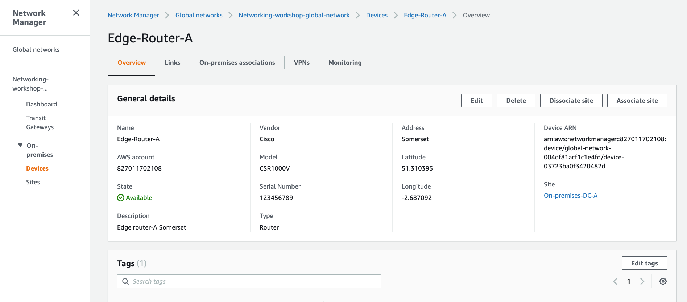
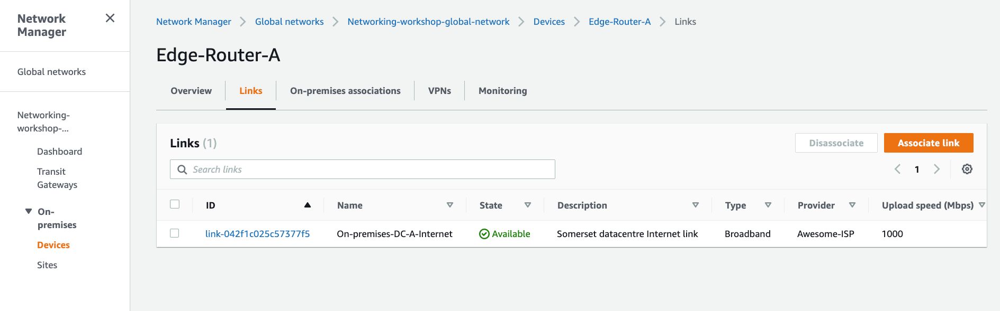

# Site configuration

To help build a graphical picture of your global infrastructure we need to supply Network Manager with some additional details about the on-premises infrastructure. In this section we will create the following resources:

- **Site** - This contains information about the physical sites we are connecting into AWS, for example datacentre details.
- **Link** - This contains details about the link capabilities we are using to connect to AWS, e.g. link speed and provider name.
- **Devices** - This stores details about the devices we are using to terminate our network connections from AWS into our on-premises facilities.


### Create a Site

1. In the AWS Management Console change to the region you are working in. This is in the upper right hand drop down menu.

1. In the AWS Management Console choose **Services** then select **VPC**.

1. From the left-hand menu select **Network Manager**. _It's near the bottom, in the **Transit Gateways** section._

1. Click **View my Global Networks** in the main panel.

1. Select the global network you just created.

1. Click **Sites** in the left-hand menu under *On-Premises*.

1. Click **Create Site** in top right and enter the following details:

   ```
      Name: On-premises-DC-A
      Description: Somerset datacentre
      Address: Somerset
      Latitude: 51.310395
      Longitude: -2.687092
   ```

1. Click **Create Site**

   


### Create a Link

1. Click into the newly created site and click on the *Links* tab.

1. Click **Create Link** and add the following details:

   ```
      Name: On-premises-DC-A-Internet
      Description: Somerset datacentre Internet link
      Upload speed (Mbps): 1000
      Download speed (Mbps): 1000
      Provider: Awesome-ISP
      Type: Broadband
   ```
1.  Click **Create Link**


### Create a Device

1. Click **Devices** in the left-hand menu under *On-Premises*.

1. Click **Create device** in top right and enter the following details:

   ```
      Name: Edge-Router-A
      Description: Edge router-A Somerset
      Model: CSR1000V
      Serial Number: 123456789
      Type: Router
      Vendor: Cisco
      Address: Somerset
      Latitude: 51.310395
      Longitude: -2.687092
   ```
1. Click **Create device**


### Associations

Now it's time to associate our newly created objects so we can properly define our topology:

1. Let's get started by associating the newly created device and the site. From the right hand side click **Associate site** and select the site we just created from the drop down. Click **Edit site association**.
   

1. Once done, we can now see the associated site at the right:
 

1. Now it's time to associate the device with the link. Switch to the tab **Links** and associate the device with the existing link
 

1. Once completed we can now see the associated link:
 

1. Lastly, we need to refer to the Customer Gateway created by CloudFormation on Lab #2 (the on-premise Cisco CSR1000v VPN router) and attach it to the Link. Click the **On-premises associations** tab and **Associate**. Under **Customer Gateway** select the cgw and under **Link** select the link we created earlier. Click **Create on-premises association**.

    


We have now added our on-premises information which will enable us to build our topology.
