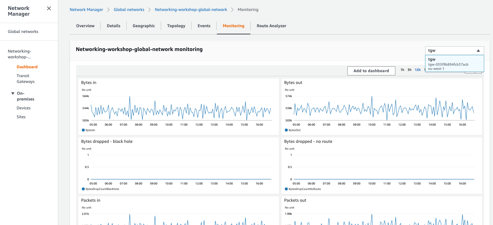

# Network Insights

Now that we have all our site information created, we can walk through Network Manager to understand what information we can see for our network.

### Geography

1. In the AWS Management Console change to the region you are working in. This is in the upper right hand drop down menu.

1. In the AWS Management Console choose **Services** then select **VPC**.

1. From the left-hand menu select **Network Manager**. _It's near the bottom, in the **Transit Gateways** section._

1. Click **View my Global Networks** in the main panel and select the global network we just created.

1. Click on the **Geographic** tab. Here we can see details of our sites and the status of the connections between them.

    

1. Click **On-premises-DC-A** within the map. This will give you detailed information about the site including the status of the VPN tunnels that connect it. After completing Lab #2, 2 VPN connections were created which make a total of 4 VPN tunnels:

    

### Topology

1. Click on the **Topology** tab. Here we can see the overall topology of the network. It details the Transit Gateway, VPCs and VPNs (taken from the Transit Gateway attachments). The links are contextual which enables us to quickly access detailed configuration details.

    

### Metrics

1. Click on the **Monitoring** tab. In a single place you can view all sorts of metrics related to your Transit Gateway. You will also be able to switch between different Transit Gateways

    
