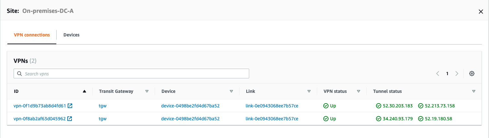
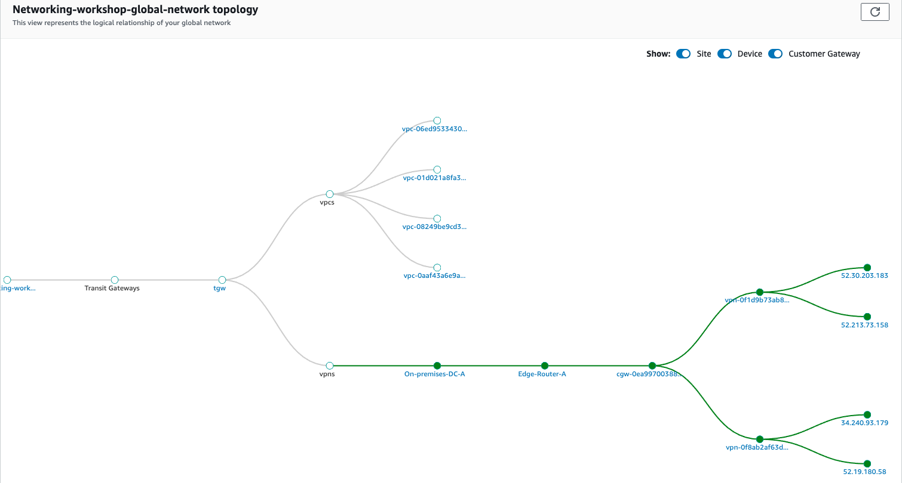

# Network Manager

Now we have all our site information created we can walk through network manager to understand what infrotmation we can view.

### Geography

1. In the AWS Management Console change to the region you are working in. This is in the upper right hand drop down menu.

2. In the AWS Management Console choose **Services** then select **VPC**.

3. From the left-hand menu select **Network Manager**. _It's near the bottom, in the **Transit Gateways** section._

4. Click **View my Global Networks** in the main panel and select the global network we just created.

5. Click on the **Geographic** tab. Here we can see details of our sites and the status of the connections between them.
    

6. Click **On-premises-DC-A**. This will give you detailed information about the site including the status of the VPN tunnels connecting the site.
    

7. Click on the **Topology** tab. Here we can see the overall topology of out network. It details our transit gateway, vpcs and VPNs. The links are contextural which enables us to quickly access detailed configuration details.
    
