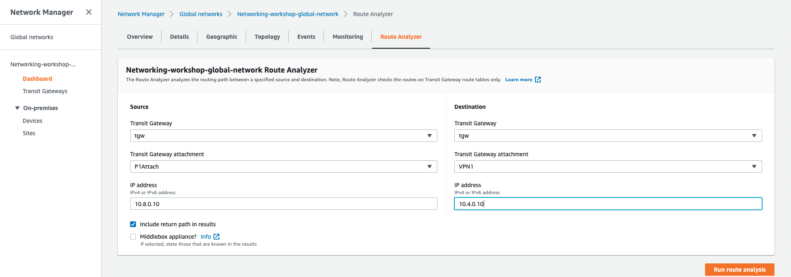
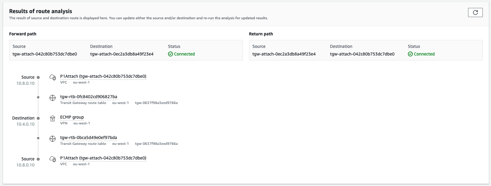
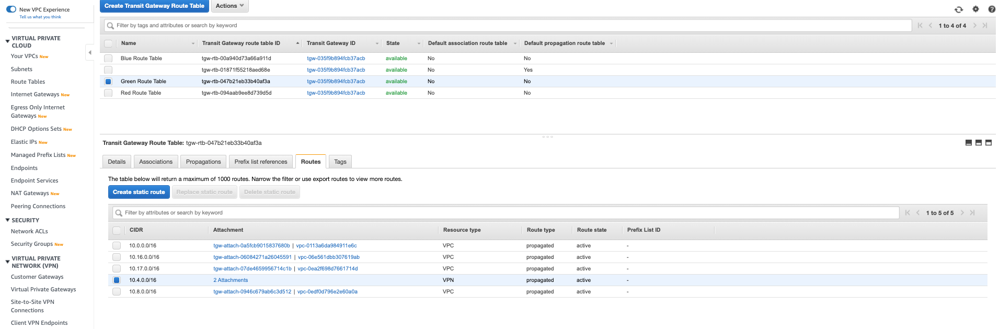
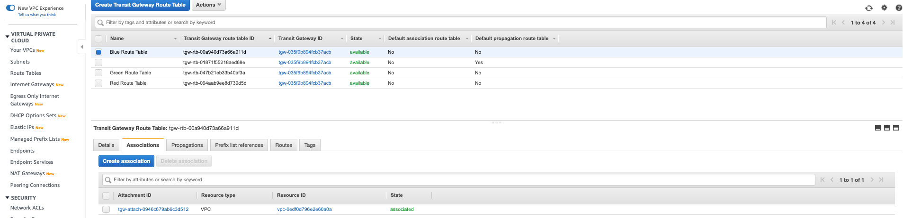
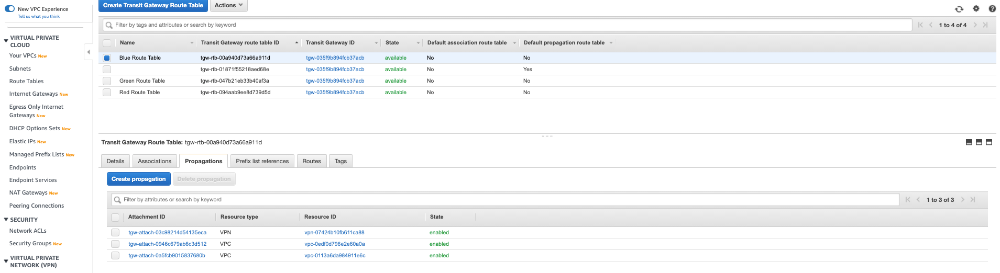
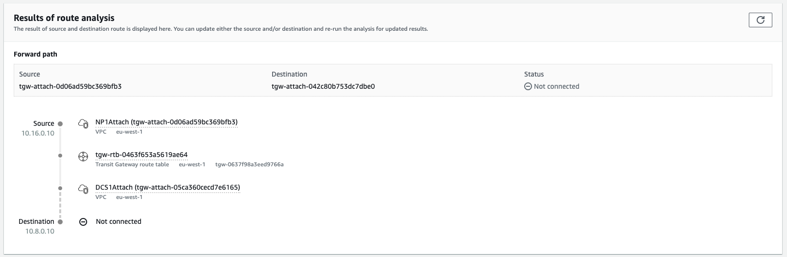

# Route Analyzer

As our network scales it can be hard to understand all routing paths that our infrastructure components will take. Network Manager Route Analyzer enables us to quickly understand which paths a connection between two IP's will take.


### Testing Production VPC (P1) to DataCenter VPC (DC1) connectivity

1. Click on the **Route Analyzer** tab. Under *Source* *Transit Gateway attachment* select **P1 attach** (our production VPC). For the *Destination* *Transit Gateway attachment* select one of the **VPN** attachments we created.

1. For the *source IP* enter **10.8.0.10** and for the *destination IP* enter **10.4.0.10**. Click **Run route analysis**.

    

1. Once the route has analyzed you will be able to see all the hops the traffic will pass through to reach the device.

    

<details>
 <summary><p style="color:blue"><b>Lab #7 - QUESTION 1 </b><i>(Click to see the answer)</i></p>
  <b> Why is the packet crossing 2 different Transit Gateway Route Tables?</b></br>
  </summary><p>

Let's look back at the original topology diagram:
	

The **Green Route Table** is associated with the VPN attachments. As a result, routes learned via VPN attachments (10.4.0.0/16) are present in this route table:
	

However, the Production VPC P1 is associated with the **Blue Route Table**, as noted in the diagram above:
	

In order to provide access from the **Blue Route Table** to the VPN attachments accessible from the **Green Route Table**, we just chose in Lab #2 to propagate the VPN attachments into the **Blue Route Table** via **Propagations**:
	

In summary, routes received from the VPN attachments are leaked into the **Blue Route Table** from the **Green Route Table** thanks to the Propagations.

</details>


### Testing Non-Production VPC (NP1) to Production VPC (P1) connectivity


1.	Repeat the test with the following values:

	```
	   Source Transit Gateway attachment: NP1Attach
	   Source IP: 10.16.0.10
	   Destination Transit Gateway attachment: P1Attach
	   Destination IP: 10.8.0.10
	```

1.	We can see the traffic gets blackholed per the Blackhole routes configured earlier:

   
