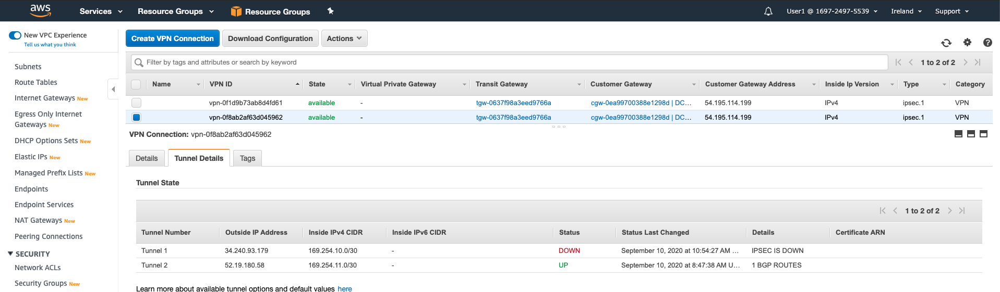
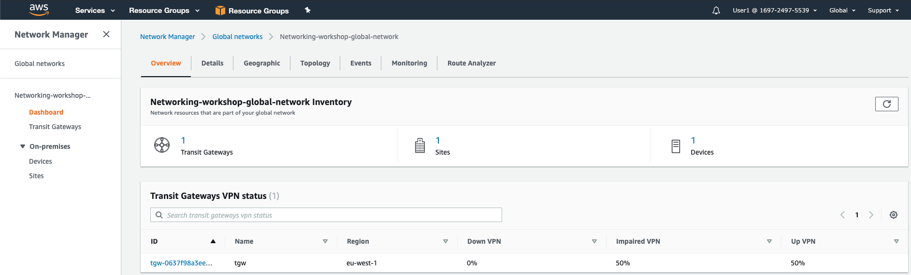
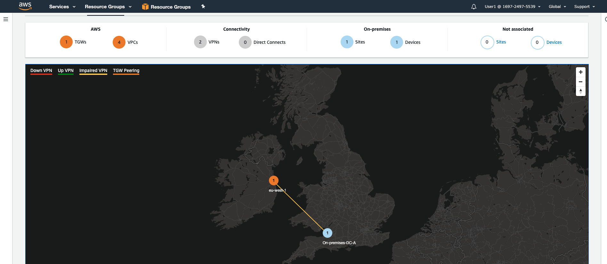
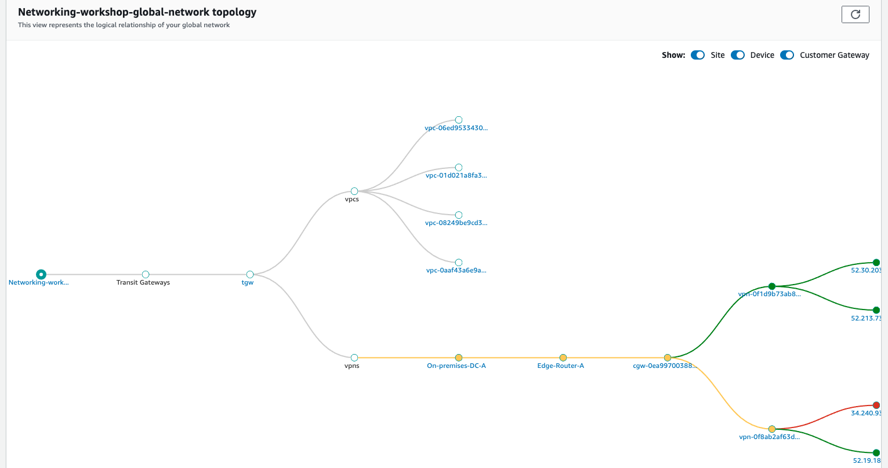
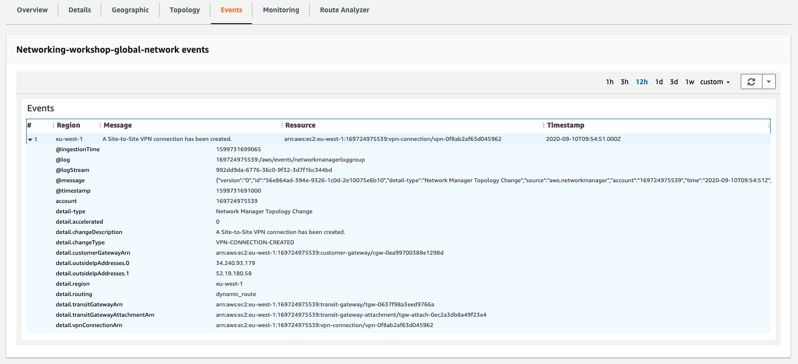

# Network Manager Troubleshooting

In this last section we will simulate a failure and use network manager to isolate where the failure is so we can start to repair it.

### Simulate a failure

In order to simulate the failure we are going to disable 1 of the VPN tunnels. We'll do this by changing the PSK assigned to one of the tunnels so it fails to connect.

1. In the AWS Management Console change to the region you are working in. This is in the upper right hand drop down menu.

2. In the AWS Management Console choose **Services** then select **VPC**.

3. In the left-hand menu click **Site-to-Site VPN Connections**, check one of the connections in the main panel, choose **Actions** and select **Modify VPN Tunnel Options**. Select either of the tunnels and change the **Pre-Shared Key** to **awsamazon1**. nd check the box for **Confirm Tunnel UP Modification**. Click **Save**. Click **Close**.

3. Wait for the status to return to **available**, this can take a few minutes. Once complete you will notice one of the tunnels states **DOWN**.
    
    
4. In the left-hand menu click **Network Manager**. Click **View my Global Networks** and select thenetwork we created earlier.

5. Instantly you will see our VPN Network shows as imparied at 50%.
    

6. Click on the **Geographic** tab and you will notice that the VPN state is now organge and showing as impaired.
   

7. Click on the **Topology** tab and you will notice that the VPN state is also showing as impaired but this time with more information on which path and tunnel is broken. You can then click on the VPN connection to get a link directly to the configuration parametrs for the tunnels.
   

8. Click on the **Events** tab and you'll be able to see the event that was generated when we made the change to the tunnel.
   

This concludes the module explaining how you can get visbility and monitoring into your global network.
